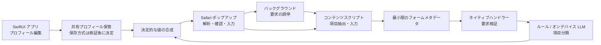

# アーキテクチャ（初期案）

状態: 固定プロフィールのプロトタイプを実装済み。以下は保存・複数プロフィール等の将来設計も含む。

現在の経路は `content.js` の候補抽出 → popup/background → `FormClassifier` のルール・Foundation Models分類 → `FillPlanner` のダミー値合成 → popupプレビュー → content入力。プロフィール保存は未実装。`analyzeForm` 1往復で分類と値合成を行う。UUID要求IDとDOMノード・メタデータ・既存値のスナップショットでプレビューを固定する。再抽出・ページ変更・実行で古い計画を破棄する。

最大40欄、テキスト120文字、select選択肢60件。モデルには更に短縮したメタデータを4欄ずつ送る。45秒経過後は次のバッチを開始せず、popupは60秒で待機を終了する（実行中の推論自体の停止は保証しない）。モデル未利用なら解析を保留、推論失敗ならルールと成功したバッチだけ提示する。HTML patternと文字数に合わない値は保留し、入力時にもWebKitで制約を再確認する。モデル由来の分類は精度保証ではなくプレビュー確認が前提。

## 責務とデータフロー



図の直接矢印は論理的なデータの流れを示す。実際の Web Extension とネイティブの通信はバックグラウンド経由のメッセージとし、コンテンツスクリプトから共有保管領域へ直接アクセスしない。

## コンポーネント

| 構成要素 | 責務 | 個人情報の扱い |
| --- | --- | --- |
| SwiftUI アプリ | プロフィール編集、拡張の有効化案内、モデル利用状態表示 | 登録・削除を扱う |
| 拡張ポップアップ | 利用者操作、対象サイト表示、入力計画の確認 | 確認に必要な値を一時表示する |
| バックグラウンド | タブと要求の調停、ネイティブへの中継 | 永続化せず要求中のみ保持する |
| コンテンツスクリプト | DOM から候補抽出、対象の再確認、値設定とイベント | 入力実行に必要な対象値のみ受け取る |
| ネイティブハンドラー | メッセージ検証、分類、プロフィール読込、計画作成 | JavaScript にプロフィール全体を渡さない |
| 分類器 | 項目識別子と分類の対応を生成 | プロフィール値を受け取らない |
| 値合成器 | 分類と書式制約から入力値を作る | モデルを呼ばず、登録情報を組み合わせる |

## メッセージ設計の案

土台の疎通用メッセージと、将来の本番プロトコルを区別する。本番では `version`、`requestID`、許可された `type` を持つエンベロープを使い、応答も同じ要求に対応付ける。

- `analyzeForm`: 候補項目のメタデータを送り、分類結果を受け取る。
- `prepareFill`: 検証済み分類と選択した `profileID` から、プレビュー可能な入力計画を作る。
- `applyFill`: 利用者が確認した計画を、対象タブのコンテンツスクリプトへ渡す。

項目 ID は一回の抽出で発行する不透明な ID とし、DOM ノード参照はコンテンツスクリプト内だけに持つ。LLM が任意の CSS セレクターや JavaScript を生成する設計にしない。

候補メタデータにはラベル、`autocomplete`、`name`、`id`、プレースホルダー、要素の種類、文字数制約、限定した選択肢、近接する住所ブロックの見出しを含める。現在の入力値、ページ全文、URL のクエリ、Cookie、隠し項目は除外する。文字数・候補数・選択肢数の上限は測定後に決める。

分類は次のような閉じた集合に対応付ける。これは設計案であり、現状コードがこのスキーマを実装しているという意味ではない。

```text
name.family / name.given / name.full
name.familyKana / name.givenKana / name.fullKana
postal.full / postal.first3 / postal.last4
address.prefecture / address.municipality / address.locality
address.street / address.building / address.full
address.combined（含める要素の順序を明示）
unknown
```

ひらがな変換、ハイフン有無、姓名間の空白などは分類と別の書式指定とする。`address.combined` は許可された住所要素の列のみ受理し、未知の値や重複要素は保留する。

## 分類と値合成

分類器はプロフィールを参照せず、値合成器へは選択済みプロフィールを明示的な引数で渡す。件数や選択UIへの依存を持たせない。

まず標準の `autocomplete` や明確なラベルに対するルールで分類し、曖昧な候補をオンデバイスモデルに渡す。モデルへの入力はフォーム由来の信頼できないデータとして区切り、返答を構造化データに限定する。候補にない ID、未知の分類、矛盾する住所構成、長すぎる出力は拒否する。

モデル自身の「自信度」は正しさの保証にしない。既知のラベルとの一致、郵便番号桁数、関連項目の整合性、選択肢との一致など、検証可能な条件で自動入力可否を決める。ルールとモデルが衝突した場合も保留理由を持たせる。

合成器はプロフィール要素を登録時の表記から作り、明示された制約だけに合わせて変換する。郵便番号補完のための外部 API やジオコーディングを暗黙に追加しない。サイトの自動補完との競合は入力・イベント後の状態を読んで判断し、上書き合戦を避ける。

## 入力実行の境界

プレビューした計画をタブ ID、要求 ID、フォームの構造の指標と結びつける。実行直前に同じ文書・候補・ラベルで、表示中・編集可能・既存値の方針に合うことを確認する。遷移、DOM 差し替え、対象消失があれば再解析を求める。

値設定は要素の標準 setter と適切な入力・変更イベントを用い、React 等での状態更新を合成フォームで検証する。すべてのサイトで反映できると仮定しない。都道府県 select は許可された選択肢の厳密な対応を検証してから設定する。自動送信や submit ボタンのクリックは実装しない。

入力値は設定時点でサイトへ開示される。表示プレビュー以前には個人情報をページ DOM に入れない。解析のためのページテキストを個人情報を含まないと断定せず、最小化とログ非出力を適用する。

## オンデバイス推論の検証ゲート

Foundation Models が第一候補だが、次の条件は最新の Apple 資料と実機で確認してから実装を確定する。Linux 上の JavaScript 検証では証明できない。

| 実験 | 確認すること | 結果による判断 |
| --- | --- | --- |
| API / deployment target | SDK、OS、端末、言語とモデル利用条件 | 対応範囲と UI の利用不能理由を決定 |
| 拡張のプロセス | ネイティブハンドラーで推論が許可・完了するか | 拡張内推論方式を採用するか判断 |
| 実行制約 | 初回・通常の時間、メモリ、キャンセル、Safari の停止 | 入力候補の上限と待ち時間方針を決定 |
| オフライン | モデル準備済み時にネットワークなしで動作するか | ローカル処理の表示と受入条件を検証 |
| 構造化出力 | 日本語ラベル、複数項目、悪意ある文面で出力が検証可能か | プロンプトと保留基準を決定 |

対象はiOS 26以降のApple Intelligence対応端末とし、非対応端末向けのルール専用版や代替モデルは提供しない。対応端末でもモデルの利用状態を実行時に確認し、未準備・利用不能なら理由を表示して解析開始を保留する。ルールは明確な欄の分類とモデル出力の検証に使用する。推論失敗時は確実に分類できた欄だけを提示し、曖昧な欄は保留する。外部モデルへは送信しない。

## 1プロフィールから拡張できる内部設計

初期版の画面と登録処理は1件のみを許可する。データモデルと処理の境界は複数件を扱えるようにし、家族・勤務先などを追加する際に分類器や値合成器を変更しない構成とする。以下は実装時の契約で、保存処理はまだ実装していない。

| 要素 | 設計 |
| --- | --- |
| `Profile` | `id: UUID`、`revision`、表示名、姓名、住所、表記設定を持つ。IDは作成時に発行し、編集で変えない |
| 姓名・住所 | `PersonName`、`JapaneseAddress` の値として分離する。プロフィールの選択や件数を知らない |
| 保存形式 | `schemaVersion` と `profiles` の配列を持つ。最初から配列で保存し、プロフィールIDの重複は拒否する |
| 選択状態 | `activeProfileID: UUID?` をプロフィール内容と分けて保持する。未登録時は `nil`、初回登録時にそのIDを選択する |
| `ProfileRepository` | 一覧、ID指定の読込、保存、削除の責務を持つ。暗号化やApp Groupの具体的な保存方式を呼び出し元から隠す |
| 登録処理 | MVPの最大1件制限を適用する。既存1件の更新は可能で、別IDの新規作成は拒否する。保管形式に件数制限は埋め込まない |
| 値合成器 | 選択済みの `Profile` を引数で受け取り、分類結果から値を組み立てる。グローバルな「本人情報」を参照しない |
| 分類器 | フォームメタデータだけを受け取り、プロフィールIDや件数に依存しない |

入力計画は `profileID` と `profileRevision` を持ち、プレビュー時のプロフィールを固定する。実行前にネイティブ側で存在とrevisionを再確認し、編集・削除・選択変更があれば再プレビューする。別プロフィールの値を古い計画へ差し替えない。IDをJavaScriptから受け取る場合も、保管領域に存在するかネイティブ側で検証する。

選択中プロフィールを削除すると選択状態を解除する。複数件対応を追加しても、別のプロフィールを暗黙に選ばない。保存形式の `schemaVersion` とプロフィール内容の `revision` は別の目的で管理し、将来の項目追加は明示的な移行処理で扱う。

将来の複数件対応では、登録件数の制限を緩め、アプリ・ポップアップへ一覧と選択UIを追加する。プロフィール内に複数の住所を持たせる設計は、家族・勤務先ごとのプロフィール追加とは別の拡張として判断する。

## 保存と権限

現時点の土台ではプロフィールを保存しない。本番では App Group の共有領域と Keychain を検証し、暗号鍵の共有、ファイル保護、端末ロック中の動作、バックアップ復元、全削除を設計する。機密データを単純に App Group の UserDefaults へ移すだけでは完了としない。

拡張のサイトアクセスは Safari 側の利用者許可を前提とする。候補抽出を開始するタイミングは利用者の操作に限定する。配布時の広範囲なサイト権限は対応サイトの方針に合わせて見直す。将来の計測も、プロフィールやページの生データを収集せず合成テスト主体とする。

## 検証の分離

- Linux / Node: メッセージスキーマ、分類・合成の純粋ロジック、固定 HTML の候補抽出。
- macOS / Xcode: プロジェクト生成、ビルド、署名・拡張埋め込み。
- iPhone / Safari: 拡張有効化、ネイティブ疎通、サイト許可、DOM 入力、モデル実行、オフライン、共有保存。

各検証は実行した環境と結果を記録する。土台の静的チェック通過を iOS ビルドや Safari 動作確認と同一視しない。
