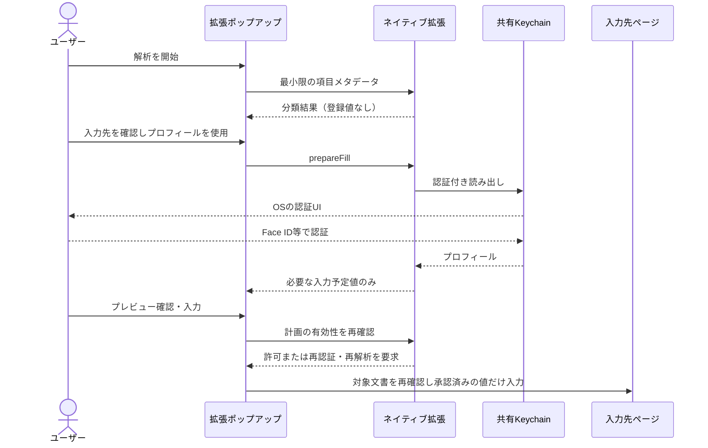

# 実プロフィールの保存・認証設計案

調査日: 2026-10-06。状態: 設計に基づく初期実装を追加。共有Keychain、編集UI、認証付きプレビュー／入力、詳細診断の無効化を実装した。Safari実機での認証・復元の検証は未完了。以下の比較・設計理由は調査時の提案を記録する。

## 実装した範囲と設計との差分

- `Shared/Profile.swift` と `ProfileRepository.swift`: バージョン付きコンテナを共有Keychainへ保存。`WhenPasscodeSetThisDeviceOnly`＋`userPresence`、同期なし。登録・保存・削除をOS認証で保護する。
- `App/ProfileSettingsView.swift`: 登録・編集・削除、バックグラウンドでのロック、非アクティブ時の表示マスク。初期版は1件。
- `SafariExtension/ProfileFillService.swift`: 値を含まない分類セッションを保持し、認証後だけ必要な値を合成する。保存情報のrevision、タブ、origin、要求ID、期限、一回限りの消費を検証する。プロセス終了でセッションは失効する。
- 初期版は認証コンテキストを操作間で再利用しない。プレビューと入力時のそれぞれで新しいコンテキストによる明示的なOS認証を行い、同じコンテキストで保護されたKeychainを読み出す。二重認証の削減は実機検証後の改善とする。
- 分類セッションは120秒、実値プレビューは60秒。DOMスナップショットは抽出から最大180秒で失効する。実行直前にも検証する。
- ページ内の一行入力は無効化した。拡張ポップアップで入力先の確認を行う。HTTPSのみ対応する。
- 詳細収録はDebug／Releaseとも無効化した。旧ログの管理画面は残す。生のモデル指示・応答をコンソールへ出すコードも撤去した。
- 自動テストはKeychain／Face IDの代わりに読み出し依存を差し替えて権限フローを検証する。これは実機のOS認証テストの代替ではない。

## 推奨する初期版

**姓名・住所は端末内の共有Keychainに保存し、読み出しをFace ID／Touch IDまたは端末パスコードで保護する。アプリ独自パスコードとクラウド同期は初期版では導入しない。**

住所1件という小さなデータ量と、iOSアプリ＋Safari Web Extensionという現行構成に合わせた提案。Keychainに小さな機密データを保存する方針はAppleの用途に合う。KeychainはOSが暗号化とアクセス制御を担い、アプリが暗号鍵を自作・管理する範囲を減らせる。[Apple: Keychain data protection](https://support.apple.com/en-sg/guide/security/secb0694df1a/web)

| 判断項目 | 提案 | ユーザーへの影響 |
| --- | --- | --- |
| 保存場所 | アプリとネイティブ拡張専用の共有Keychain | サーバーへの登録不要 |
| 保存時の保護 | `WhenPasscodeSetThisDeviceOnly`＋`userPresence` | 端末パスコードの設定が必要 |
| 利用時の認証 | OS標準のFace ID／Touch ID、代替は端末パスコード | 新しい暗証番号を覚えなくてよい |
| 認証タイミング | プロフィール表示・編集、Safariで実値を取得するとき | ページ解析だけでは認証しない |
| 同期・バックアップ | 初期版では対象外 | 機種変更・端末喪失後は再登録 |
| Safariでの確認 | 拡張ポップアップに入力先と予定値を表示して確定 | ページ内ボタンだけで実住所を即入力しない |
| 詳細診断 | 実プロフィールを扱う配布版には生データ収録を含めない | 通常の匿名化診断を使う |

## 現行実装から分かったこと

- `App/ProfileSettingsView.swift` は編集不可の `DummyProfile` を表示する。`Shared/FillPlan.swift` も内部でダミープロフィールを生成するため、保存したプロフィールを明示的に渡す形への変更が必要。
- `analyzeForm` は分類と値合成を一度に実施し、JavaScriptに入力予定値を返す。実プロフィール導入時は「分類」と「認証付きの値取得」を分ける。
- `analyzeInline` はページ内ボタンからネイティブに要求し、その応答を直接入力する。実値を返す経路には認証と入力先の確認が必要。
- 両ターゲットにApp Groupはあるが、プロフィール専用のKeychain共有・認証設定は未実装。構成の正本は `project.yml`。
- `Shared/DebugReportStore.swift` は詳細JSONをApp Groupへ保存する。完全ファイル保護とバックアップ除外は実装済みだが、アプリ独自の暗号化やユーザー認証はなく、DOM全文・入力前後の値を含み得る。通常の診断と詳細診断は別経路なので、両方の点検が必要。
- 既存の `docs/architecture.md` にある `ProfileRepository`、プロフィールID／revision、分類器へプロフィール値を渡さない方針は維持できる。

## 守る範囲と限界

| 想定する事象 | 対策・限界 |
| --- | --- |
| ロックされた端末の紛失、保存データのコピー | Keychainの端末限定保護。認証なしでの読み出しを拒否 |
| ロック解除済み端末を他人に貸す | アプリを開けるだけでは住所を表示せず、利用時に追加認証 |
| 端末パスコードを知っている第三者 | 推奨案では解除できる。ここまで防ぐ要件なら別の認証方針が必要 |
| 他アプリからのアクセス | 署名と専用アクセスグループによる制限 |
| 悪意あるページ、誤分類、ページ遷移 | 対象サイトの確認、送信元検証、必要な欄だけへの入力、実行直前の再検証 |
| デバッグログ・バックアップ・クリップボードへの複製 | 値を記録・自動コピーしない。生データ収録経路を配布版から除外 |
| アプリ／拡張プロセスの侵害、OS侵害、ユーザーによる画面撮影 | 完全な防御は保証しない。認証後の平文の保持時間と範囲を最小化 |

**フォームへ値を設定した時点で、送信ボタンを押す前でもサイトのJavaScriptは値を読み取れる。** 認証と暗号化は入力先サイトの善良性を保証しない。住所にはパスワードのような固定の利用先ドメインがないため、ユーザーによる入力先確認が必要になる。

## 保存方式の比較

| 方式 | 評価 | 採用判断 |
| --- | --- | --- |
| `UserDefaults`、`browser.storage`、通常の共有JSON | 個々の実値取得をOS認証に結び付けにくい。共有先やコピーが増える | プロフィールには不採用 |
| Keychainにプロフィール全体を保存 | 小規模データ向き。OSの暗号化・認証制御を利用できる | **初期版の推奨** |
| App Groupの暗号化ファイル＋Keychainの鍵 | 大きなデータ、添付、多数の項目には適する。鍵・更新・破損・移行の設計が増える | データ量増加時に再検討 |
| サーバー／クラウド同期 | 複数端末で便利。鍵配布、復旧、競合、削除の設計が必要 | 初期版では不採用 |

将来ファイル方式に移る場合は、CryptoKit等による認証付き暗号（例: AES-GCM）、安全に生成した鍵、nonceの非再利用、原子的更新、完全ファイル保護、バックアップ方針を一緒に設計する。暗号文と無保護の鍵を同じ共有ディレクトリに置かない。OWASPも機密情報の保存最小化、標準ライブラリ、認証付き暗号を推奨する。[OWASP: Cryptographic Storage](https://cheatsheetseries.owasp.org/cheatsheets/Cryptographic_Storage_Cheat_Sheet.html)

### Keychainの具体案

- `kSecClassGenericPassword` の `kSecValueData` に、バージョン付きのプロフィールコンテナを保存する。
- コンテナは `schemaVersion`、`profiles: [Profile]`、`activeProfileID` を持つ。選択状態は各プロフィール内容から分離し、同じ保護対象コンテナ内で整合的に更新する。MVPの登録上限は1件。
- `Profile` は既存案のUUID、revision、姓名、カナ、住所、表示設定を持つ。表示名も個人情報として扱う。
- `service`／`account`／`label` 等の検索属性には固定識別子を使い、姓名・住所を入れない。
- `SecAccessControlCreateWithFlags` に `kSecAttrAccessibleWhenPasscodeSetThisDeviceOnly` と `.userPresence` を指定し、作成したアクセス制御を項目に設定する。`kSecAttrSynchronizable` はfalse。認証なしで読める別コピーを作らない。
- 専用の共有Keychainアクセスグループを両ターゲットに設定し、クエリで明示する。既存App Groupのファイル共有設定と混同しない。共有グループのメンバーは同じ信頼境界に入る。
- 読み出しは `ProfileRepository` 内に閉じ込め、JavaScriptにプロフィール一覧取得・全文取得APIを公開しない。更新・削除はアプリ側だけに実装する。これはAPI上の制限であり、共有グループがOSレベルで拡張を読み取り専用にするわけではない。
- 更新・削除にもアプリの認証チェックを設ける。読み出し用ACLだけで全変更操作の認証が保証されると仮定しない。更新成功前に旧データを削除せず、失敗時は旧データを維持する。
- 保存サイズにアプリ側上限を設ける。具体値は姓名・住所の入力上限から決め、境界サイズを実機測定する。Keychainを無制限のデータベースとして使わない。

共有の仕組みはAppleのKeychain Sharingに基づく。署名済みのアプリ・拡張の両方で検証する。[Apple: Configuring keychain sharing](https://developer.apple.com/documentation/xcode/configuring-keychain-sharing)

`WhenPasscodeSetThisDeviceOnly` は端末パスコードが必要で、iCloud Keychain同期・バックアップの対象外となり、パスコードの除去／リセットで利用できなくなる。通常のパスコード変更と、除去・リセットは区別して試験する。すべての `ThisDeviceOnly` 属性が同じバックアップ動作という意味ではない。[Apple: Keychain data protection](https://support.apple.com/en-sg/guide/security/secb0694df1a/web)

## Face IDと独自パスコード

### 推奨: OS標準認証に一本化

Face IDは住所の暗号鍵そのものではなく、保護されたデータへのアクセスを許可する手段として使う。画面だけを `LAContext.evaluatePolicy` でロックし、その裏で無条件にデータを読める構成にはしない。**Keychainの読み出し自体に認証条件を設定する。** AppleのサンプルもSecurityとLocalAuthenticationを組み合わせる。[Apple: Accessing Keychain Items with Face ID or Touch ID](https://developer.apple.com/documentation/localauthentication/accessing-keychain-items-with-face-id-or-touch-id)

| 方針 | 利点 | 注意点 |
| --- | --- | --- |
| `.userPresence` | 生体認証または端末パスコードで利用できる | 端末パスコードを知る人からは守れない |
| `.biometryCurrentSet` のみ | 登録済み生体認証に限定できる | 生体情報の再登録等で項目が無効化される。代替復旧が必要 |
| アプリ独自パスフレーズ | 端末の認証情報と別の秘密を持てる | 忘却時の対応、鍵導出、試行制限、復旧が必要 |

生体登録変更時の失効はAppleの仕様。住所の再登録負担と認証不能時の使いやすさを考え、初期版は `.userPresence` を推奨する。[Apple: biometryCurrentSet](https://developer.apple.com/documentation/security/secaccesscontrolcreateflags/biometrycurrentset)

### パスワード管理アプリから何を取り入れるか

1PasswordはアカウントパスワードとSecret Keyを組み合わせてデータを保護し、Face IDは日常の解除操作を容易にする。同期する保管庫と、端末内の住所1件では設計上の要求が異なる。[1Password: Secret Key](https://support.1password.com/secret-key-security/)、[1Password: Face ID](https://support.1password.com/face-id/)

取り入れるのは、認証とデータ保護の結合、自動ロック、解除失敗時に値を返さないこと、平文の保持を短くすること。独自のマスターパスワードまで初期版に持ち込む必要はない、というのが本提案の判断。

将来「端末パスコードを家族が知っていても住所を見せない」「OSのアカウントと独立した同期・復旧」を求める場合には再検討する。その場合も短い4〜6桁PINを単純に照合する画面ロックでは不十分。パスフレーズからの鍵導出、ランダムなデータ鍵の保護、オフライン総当たり耐性、忘却時の消去／復旧を一体で設計する。Face IDまたは独自パスフレーズのどちらでも解除できるなら、その構成を二要素認証とは呼ばない。

## Safariでのデータフローと認証寿命

メッセージの中継は現行と同じbackground経由。図では省略している。具体的な契約案は次のとおり。

1. `analyzeForm` は分類専用にする。未解除でも実行できるが、プロフィールの存在・内容を不要にページへ公開しない。
2. `prepareFill` は信頼する拡張UIからだけ受理し、ネイティブ側で認証・読込・値合成する。分類結果も再検証し、LLMやDOMの要求をそのまま権限として扱わない。
3. 計画は `planID`、`requestID`、タブ、トップレベルorigin、文書世代、対象欄のスナップショット、`profileID`／revision、有効期限に結び付ける。origin等はページからの自己申告でなくブラウザーの送信元・タブ情報から構成する。ネイティブからSafariの状態を直接証明できると仮定せず、backgroundを信頼境界として明示する。
4. プレビューは拡張ポップアップ内に置き、ページDOMに氏名・住所・プロフィール名を表示しない。ページ由来ラベルはテキストとして描画し、HTMLとして挿入しない。
5. `applyFill` の前に、プロフィールの存在・revision・選択状態と認証状態をネイティブ側で再確認する。直後にcontent側で同じ文書・対象ノード・編集可能性・制約を再確認する。値は必要な欄の分だけ渡し、自動送信しない。
6. 計画は一度だけ消費できるものとし、二重実行・遅れて返った応答を拒否する。取得後60秒を有効期限の初期案とし、解析時間とは分ける。これは製品側の暫定値であり、OSの保証値ではない。

MVPは端末全体で共有する「5分間ロック解除済み」のような状態を作らない。アプリ側は画面の非表示・バックグラウンド移行で実値の表示と参照を解除し、アプリ切替画面にもマスクをかける。生体認証UI表示に伴う一時的な非アクティブ化と、バックグラウンド移行は区別する。

拡張側はプレビューの終了、タブ／文書の変更、期限切れ、入力完了、キャンセルで計画と実値を破棄する。Safariではプロセス停止やライフサイクル通知がアプリと同じとは限らないため、通知だけに依存せず、実行時にも期限と認証を確認する。停止・再起動で認証コンテキストや計画を失ったら、再認証・再プレビューする。

認証済みの `LAContext` を同一操作内で再利用できる場合のみ、プレビューと入力時の二重認証を避ける。ネイティブ要求をまたぐ保持や再利用を保証しない。保護された再読込に追加認証が必要なら要求する。解除フラグや平文キャッシュをApp Group／JavaScriptの永続ストレージへ置いて回避しない。JavaScript・Swiftの文字列について完全なメモリ消去を保証せず、コピー数・寿命を減らす。

### ページ内「自動入力」ボタン

実プロフィールの初期対応はポップアップ経由を優先する。ページ内ボタンは入力開始の案内に留め、既存の `analyzeInline` へ実プロフィールをそのまま差し替えない。ページ内UIはサイトから隠す・重ねる等の干渉を受け得るため、ユーザー操作の判定だけを承認の根拠にしない。

将来の直接入力では、信頼できる拡張UIによる入力先確認、認証、トップフレーム限定、実イベント確認、リプレイ防止を含めて別途検証する。実住所の入力先はHTTPSのトップレベルページに限定する案とし、HTTP・iframeへの対応は初期版から外す。既存のダミー用HTTPテストとは区別する。

## ログ、復旧、削除

### ログを別の住所保管庫にしない

- 配布版では詳細DOM・入力値・モデル入出力の生データ収録コードと `saveDeveloperReport` の受理を除外する。画面からボタンを隠すだけでは足りない。
- 開発用ビルドの生データ診断はダミー専用とし、実プロフィール保管機能と併用しない。テストは合成データで行う。
- 通常の診断はイベント種別・件数・エラーコード等の許可リスト方式にする。住所の一致置換だけでは、分割値・カナ・書式変換後の値を取り逃がす。
- 保存、native message、入力計画、例外、クラッシュ収集に実値を出さない。ラベルやURLパスにも個人情報が入り得る。氏名・住所のハッシュも分析用に保存しない。
- 既存の詳細ログは、実プロフィールの初回設定前に保存有無を知らせて削除を案内する。外部に共有済みのログまでは回収できない。
- プロフィールをクリップボードへ自動コピーしない。初期版ではプロフィールの平文エクスポートを用意しない。

### 復旧と削除のUX

- 初回保存前に「この端末にのみ保存。機種変更や端末パスコードの解除・リセット後は再登録が必要」と表示する。
- パスコード未設定なら保存を中止して設定を案内する。認証拒否・キャンセル・認証UI利用不能なら値を返さず、ユーザー操作による再試行を待つ。
- 項目なし、認証失敗、アクセス不能、破損・未知スキーマは区別する。キャンセルや一時的失敗を「未登録」と扱って上書きしない。
- アプリ内に「プロフィールを削除」を設け、認証後にKeychain項目、選択状態、進行中計画を無効化する。別プロセスに即時通知できなくても実行時の再読込で拒否する。
- アプリのアンインストールだけでKeychainの削除が保証されるとは扱わない。再インストール時の残存項目は認証前に表示・利用せず、認証後に再利用または明示削除を選べるようにする。
- フラッシュ上の物理的な完全消去や、既に入力先サイトへ渡ったデータの削除は保証しない。

## 実機検証で確定する事項

AppleはWWDC26で `SafariWebExtensionHandler` からLocalAuthenticationを呼ぶ例を提示している。ただし、その例はKeychainで保護されたプロフィール読出しや、本プロジェクトの最低対応iOS 26での動作を実証するものではない。**Safari拡張から認証付きKeychain読出しが成立することを、最初の技術検証とする。** [Apple: Create web extensions for Safari（23:55付近）](https://developer.apple.com/videos/play/wwdc2026/216/)

| 試験 | 合格条件 |
| --- | --- |
| iOS 26の実機と最新対応OS、署名済みアプリ・拡張 | 両方から同じ専用Keychain項目へアクセスできる。他グループからは不可 |
| Safariポップアップからの保護付き読出し | OS認証UIが表示され、成功した場合のみ実値が返る |
| Face ID許可・拒否・未登録・ロックアウト | OS標準の代替認証または利用不能として扱い、認証を迂回しない |
| `NSFaceIDUsageDescription`、ターゲットごとの設定 | 必要なInfo.plistと署名設定を実機で確認し、`project.yml` に反映 |
| 認証中の画面遷移、キャンセル、拡張終了 | 古い成功応答で表示・入力されない |
| 再起動、端末ロック、バックグラウンド復帰 | 保存情報と古い入力計画が無認証で利用されない |
| パスコード変更／除去／リセット、生体情報変更 | 選択した保護クラスどおりの挙動。データ消失・再登録の表示が正しい |
| 端末復元、機種変更、再インストール | 同期・復元の期待値と残存項目の扱いが説明どおり |
| 遷移、DOM差し替え、別タブ、別origin、期限切れ、再送 | 入力を拒否し、必要に応じて再解析・再認証 |
| プレビュー後のプロフィール編集・削除 | 古いrevisionの値を入力しない |
| ログ・共有ファイル・ストレージ・バックアップ点検 | 合成プロフィールの実値が意図しない場所に残らない |
| 壊れた保存データ、未知スキーマ、更新失敗 | 自動初期化で旧データを失わず、安全に失敗する |

認証UIが拡張から利用できない場合、アプリで解除したという共有フラグや、認証不要のコピーで代替しない。アプリとの明示的な操作連携を別途設計するか、対応OS・入力UXを見直す。実機検証前に「Safari内で毎回1回のFace IDだけで完了」とは約束しない。

## 実装の順序

1. 合成プロフィールだけで共有KeychainとSafari内認証を検証する。
2. 配布版の詳細診断経路を閉じ、実値が漏れない通常診断を確認する。
3. `ProfileRepository`、保存モデル、登録・編集・削除UIを実装する。
4. 分類と値合成を分け、認証付きプレビューと一回限りの入力計画を実装する。
5. ロック・再インストール・入力先変更・ログの受入試験を通して実プロフィール利用を有効にする。

初期版で採用判断が必要なのは、**機種変更時の再登録を許容するか**、**端末パスコードでの代替解除を許容するか**、**実住所の入力をまずポップアップ経由に限定するか**の3点。現時点ではすべて許容する案を推奨する。
